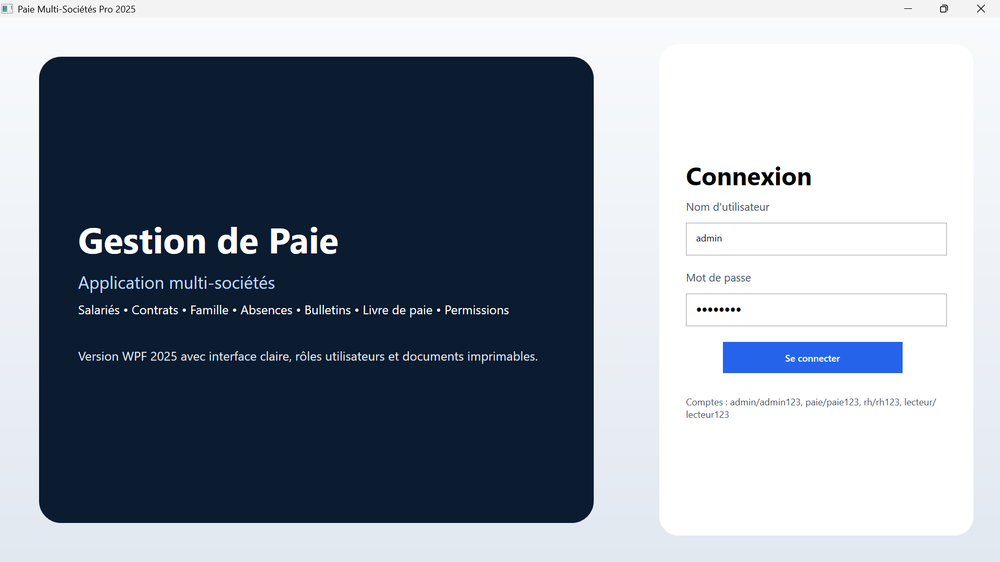
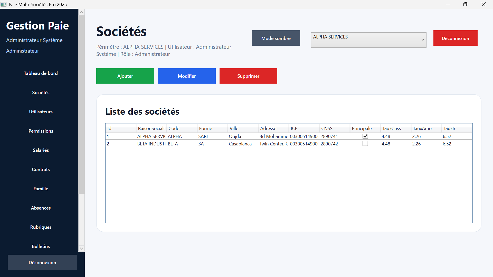
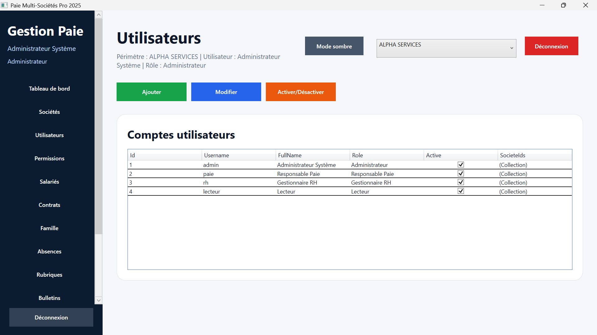
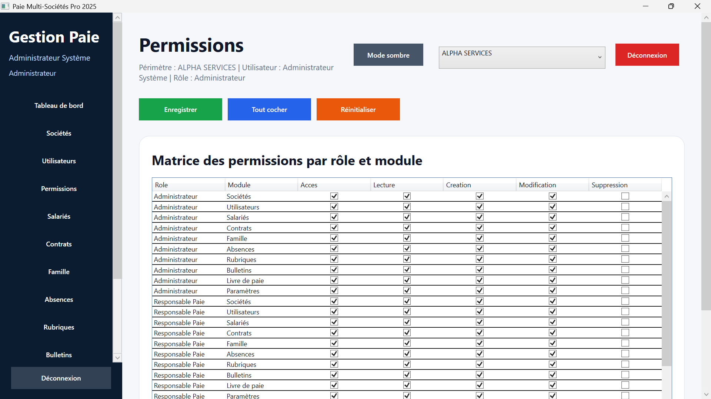
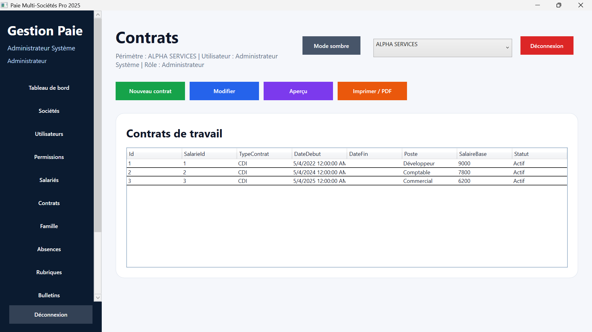
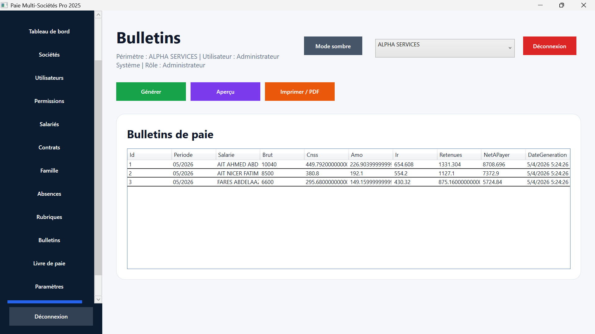
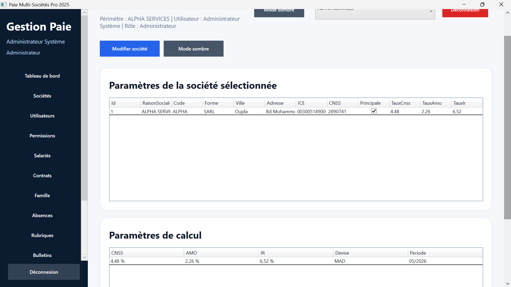
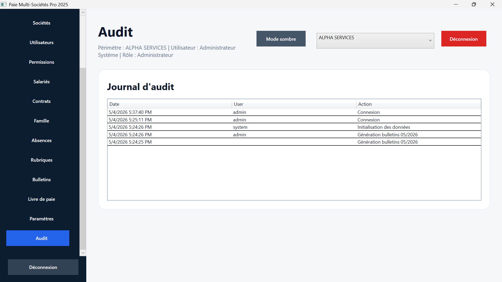

# 💰 Paie Multi-Sociétés Pro 2025 — Payroll Management System

> Application desktop professionnelle développée en **C# (WPF)** pour la gestion complète de la paie multi-entreprises.

---

## 🚀 Overview

Paie Multi-Sociétés Pro est une solution logicielle permettant de gérer efficacement la paie dans plusieurs entreprises depuis une seule interface.

Elle couvre l’ensemble des besoins métier :
- gestion des salariés
- calcul des salaires
- génération des bulletins
- suivi des paiements
- contrôle des accès et permissions

---

## ✨ Fonctionnalités principales

- 👥 Gestion des employés
- 🏢 Gestion multi-sociétés
- 💰 Calcul automatique des salaires
- 📄 Génération de bulletins de paie
- 📊 Tableau de bord analytique
- 🔐 Gestion des utilisateurs & rôles
- 📘 Livre de paie
- ⚙️ Paramétrage système
- 🕵️ Audit & traçabilité des actions

---

## 🧱 Technologies utilisées

- C# (.NET)
- WPF (Windows Presentation Foundation)
- SQL Server
- Architecture en couches (logique métier + UI)

---

## 🎯 Objectif du projet

Ce projet vise à simuler un logiciel professionnel de gestion de paie utilisé en entreprise, en intégrant :

- une logique métier réaliste
- une interface moderne et ergonomique
- une gestion sécurisée des données

---

## 📸 Captures d’écran

### 🔐 Connexion
Interface sécurisée d’accès à l’application.

---

### 📊 Tableau de bord
Vue globale des indicateurs clés et statistiques.

---

### 🏢 Gestion des sociétés
Administration des différentes entreprises.

---

### 👤 Gestion des utilisateurs
Création et gestion des comptes.

---

### 🔐 Gestion des permissions
Contrôle d’accès basé sur les rôles.

---

### 👥 Gestion des salariés
Suivi complet des informations des employés.

---

### 📄 Gestion des contrats
Organisation des contrats de travail.

---

### 💰 Bulletins de paie
Génération automatique des fiches de paie.

---

### 📘 Livre de paie
Historique global des paiements.

---

### ⚙️ Paramètres système
Configuration avancée de l’application.

---

### 🕵️ Audit
Suivi et traçabilité des actions utilisateurs.

---

## 🔒 Code source

Le code source de cette application est **privé**.  
📩 Disponible sur demande pour les recruteurs.

---

